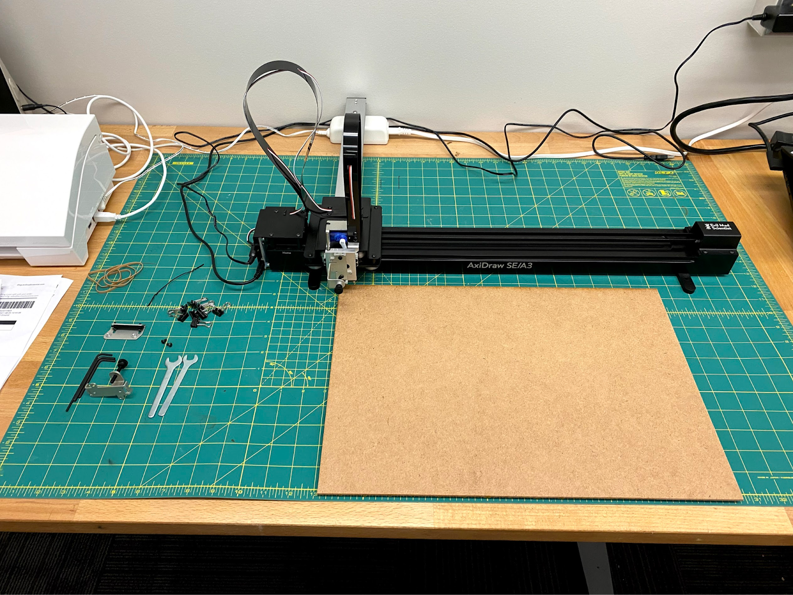
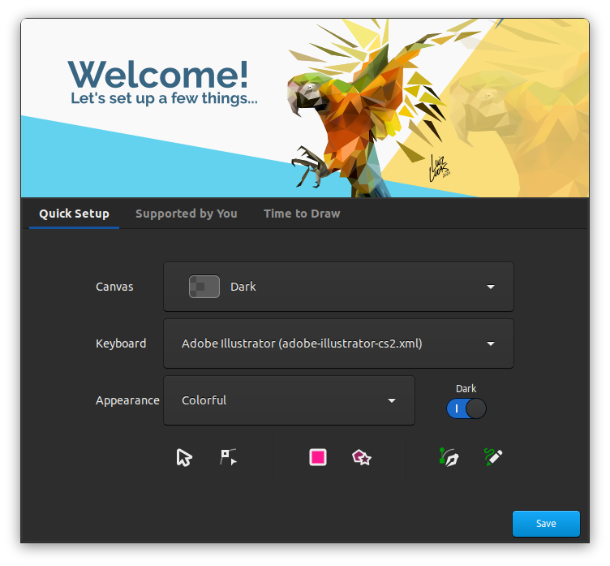
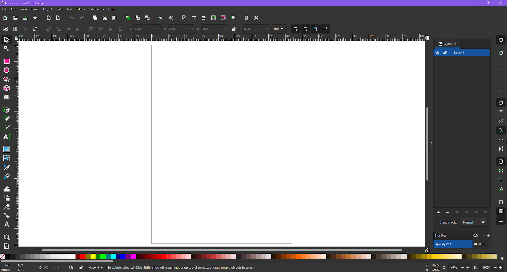
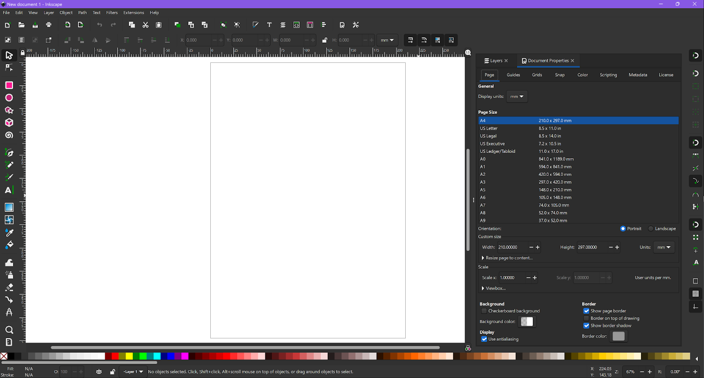
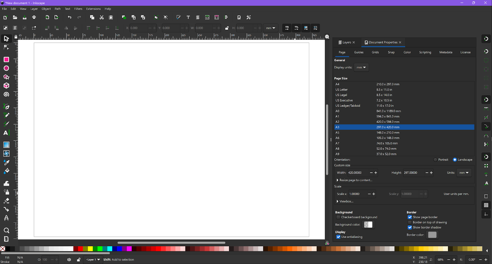
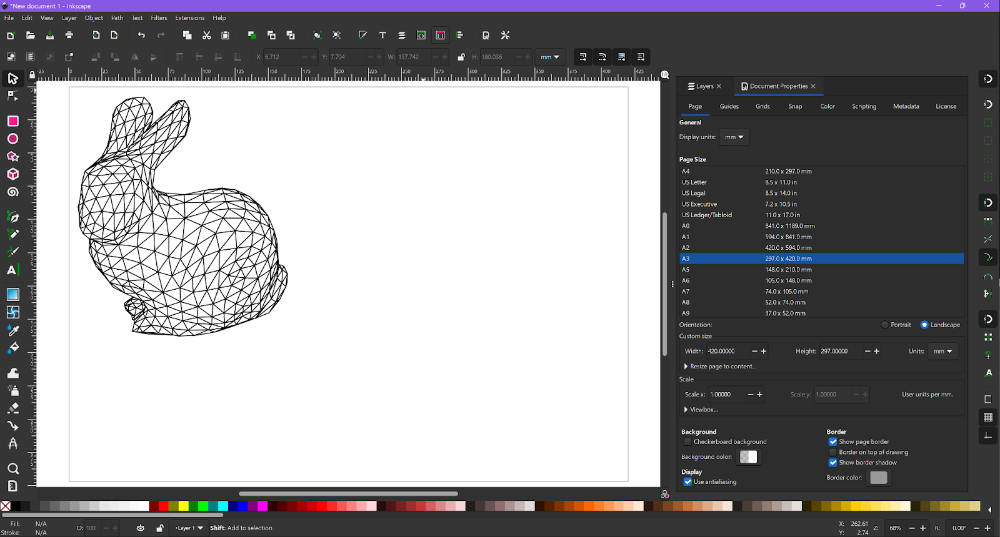
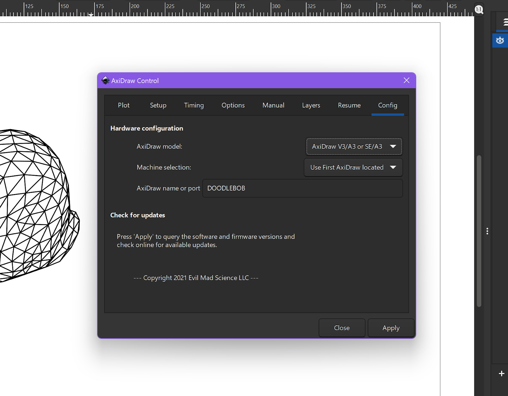
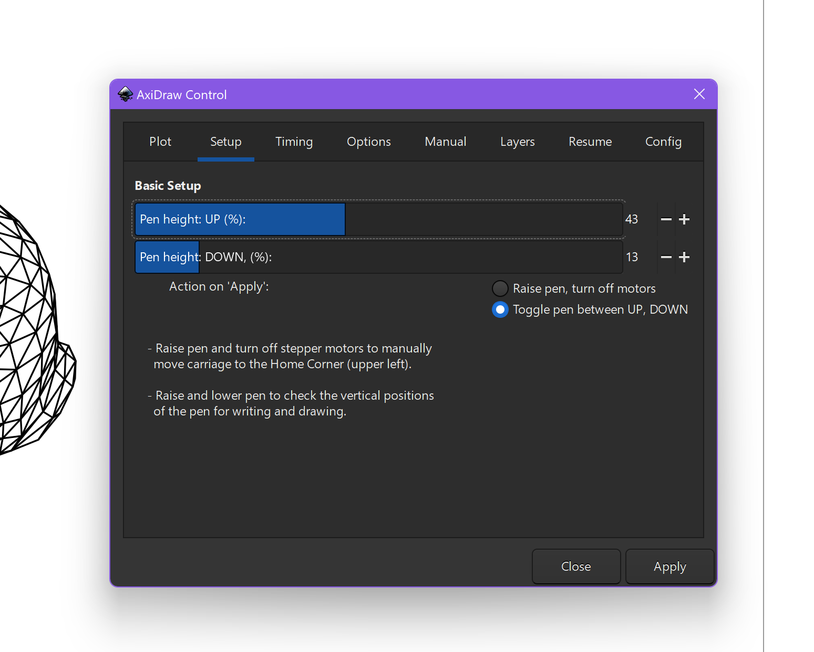

# AxiDraw Standard Operating Procedure

Last updated on 14 February 2023

This is the Standard Operating Procedure for the Machine Agency AxiDraw(s). For
questions about this machine, contact the machine manager.

- Author: Hannah Twigg-Smith
- PI: Nadya Peek
- Shop Safety Coordinator: Nadya Peek

|                                               |                                                                      |
| --------------------------------------------- | -------------------------------------------------------------------- |
| #1 Process (if applicable)                    | This machine moves an end effector, usually a pen, in two dimensions |
| #2 Equipment                                  | Two-axis plotter                                                     |
| #3 Personal Protective Equipment (PPE)        | Tie back long hair                                                   |
| #4 Environmental/Ventilation controls         | N/A                                                                  |
| #5 Required training or approval              | Contact machine manager for training                                 |
| #6 Inspection requirements before use         | N/A                                                                  |
| #7 Safe operating procedures or precautions   | See instructions detailed below                                      |
| #8 Chemicals/ spill procedures/waste disposal | N/A                                                                  |

---

## General Information

**Machine Manager:** Hannah Twigg-Smith, htwigg@uw.edu

**Description:** The AxiDraw is a two-axis pen plotter developed by Evil Mad
Scientist Labs. Equipment covered by SOP: Machine Agency owns one regular-sized
AxiDraw. Hannah brought in her own AxiDraw Minikit and is happy to let people
use it if they ask her first.

**Who can use the machine:** People who have been trained by the machine manager
and are documented in the machine training spreadsheet.

**How to get access:** Contact Hannah via email or discord

**How to get your access revoked:** Repeatedly breaking the rules.

---

## Rules

1. Cap your pens when you’re done using them! You'd be surprised how expensive
   pens can be.
2. Related: don’t waste nice pens and paper. If you’re unsure how a plot will
   work out, test it on some printer paper with a cheap ballpoint pen first.
3. If you want to test different heads on the AxiDraw, that’s great! But talk to
   the machine manager first.
4. Make sure to home and zero the machine before running. The Minikit has no
   limit switches and can hurt itself if it tries to move outside of its work
   envelope.

## Important Information and Safety

The AxiDraw is a small machine that you generally don’t need to worry too much
about. That said:

1. Long hair can get stuck in the belt. Make sure to tie it back and don’t bend
   over the machine while it is running. (I [Hannah] have done this and it
   hurts)
2. You must manually home the AxiDraw before use. There aren’t limit switches,
   so it doesn’t know when it is trying to go out of bounds and will make angry
   noises.

## Materials

If you have questions about acceptable materials, contact the machine manager.
They can add additional materials to this list if needed. The AxiDraw can swap
out tool-holders, so it would be straightforward to develop your own holder for,
say, an oddly-shaped pen or Expo marker.

### Acceptable Materials

- Pens of all sorts
- Implements that can be held in the AxiDraw tool-holder. For example:
  - A watercolor brush!
  - A stick!
  - An LED, for light painting!

### Unacceptable Materials

- Use your best judgment. The AxiDraw is pretty simple.

The AxiDraw!

## Step-by-step Instructions

There are multiple ways to plot things with the AxiDraw. The easiest way is to
use the Inkscape plugins, which I will cover here. EMSL has detailed
documentation on using the AxiDraw with their Python API and command line tools:

- Python API: <https://AxiDraw.com/doc/py_api>
- CLI: <https://AxiDraw.com/doc/cli_api>

## Controlling the AxiDraw via Inkscape

EMSL has comprehensive installation instructions for all of the different
methods of controlling it. Install the AxiDraw extension using the instructions
from EMSL, which can be found on the wiki here:
<https://wiki.evilmadscientist.com/AxiDraw>

When you launch inkscape, you will see this screen:

I choose the Adobe Illustrator keyboard option as I am already familiar with
that set of keyboard shortcuts. The default Inkscape shortcuts are a bit
different than Adobe’s, but I find Adobe to be more intuitive. Once you set up
your document, you’ll see the default canvas: 

### Setting up the document

You will notice that Inkscape has loaded a default 8.5x11” canvas. When using
the AxiDraw, it is very helpful to resize the canvas to the size of the work
envelope. If you don’t do this, the plugin will automatically resize your
drawing, which can result in some unexpected behavior. To change the document
size, navigate to File>Document Properties, which will open the Document
properties pane: 

I am going to plot with the AxiDraw SE/A3, so I will resize the document to be
the same size as a sheet of A3 paper. There’s an easy preset you can choose. I
also switch the document to landscape, as that will allow me to dictate where in
the work envelope the drawing will be drawn. My workspace now looks like this:

Hint: Ctrl + 0 will fit the document to the view window.

Now, create a drawing or import an SVG. I usually obtain the SVGs from elsewhere
and import them. I’ve included a bunch of sample SVGs in the “Example files”
folder. Here, I’ve imported bunny.svg and moved/resized it to my desired
location: 

### Setting up the Plot

To connect to the AxiDraw, first plug the USB cable into your computer. Open the
AxiDraw Control extension (Extensions>AxiDraw Control, assuming you’ve installed
the extension properly). In the Config tab, select the appropriate AxiDraw model
and machine. It will automatically search for a connected machine, but you can
also specify a specific machine if multiple machines are connected. Here, I have
told the extension to plot to DOODLEBOB: 

Now, navigate to the Setup tab. Here you can set the pen raised/lowered state
heights. This will be specific to your situation and will depend on where you
set the pen. I recommend testing the pen heights on a scrap piece of paper
before plotting. The easiest way to dial in the correct height is to repeatedly
hit Apply to toggle the up and down states, and tweak the percentage sliders
and/or the pen location in the tool holder. This is usually the most annoying
part of setting up a plot. 

It is also good practice to make sure that the height percentages here will be
sufficient when the AxiDraw arm is fully extended, as that can result in small
variations in the z-height. To do this, use the controls in the Manual tab to
move the pen to the extremes of the work envelope, and repeat the
pen-height-setting process. Once you’ve gotten height controls that work, return
the pen to the home position. By default, the AxiDraw will plot paths on all
layers except those that are named with a “%” at the beginning. When setting up
your plot you can place useful but undesired paths such as guides on these
layers. You can also specify a layer range to plot in the Layers tab, but I
haven’t had the need to do this before.

### Now, Plot

Finally, it’s time to plot! In the Plot tab, select the number of plots to make
(usually one) and hit apply. If everything is set up correctly, the AxiDraw will
zoom around and make you a bunny. Yay!

### After you’ve finished plotting

1. Unplug the AxiDraw from power
2. Remove and re-cap any pens you used
3. Clean up your workspace! Return pens and paper to storage.

### Best Practices

1. Optimize your vector drawing before plotting. There are many ways to do this.
   EMSL includes an extension for optimization that you can use if plotting via
   Inkscape.

### Tips and Tricks

1. Because the AxiDraw draws vector images rather than raster images, finding a
   font can be difficult. Single line fonts, also known as Hershey fonts, are
   perfect for plotting. Inkscape includes a plugin for converting text to
   single-line fonts.

## Additional Information and Resources

- EMSL website: <https://shop.evilmadscientist.com/>
- Inkscape website: <https://inkscape.org/>
- People on Twitter use the #PlotterTwitter hashtag to show off cool projects!
- Hannah wrote a paper on #PlotterTwitter with lots of info on creative coding:
  <https://dl.acm.org/doi/10.1145/3411764.3445653>
- drawingbots.net has a lot of resources and information about creating
  plottable graphics and which materials to choose. The website also links to a
  Discord server where you can talk to Plotter enthusiasts.
