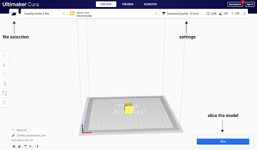

# Ender3 3D Printer Standard Operating Procedure

Last updated on 3 January 2022

This is the Standard Operating Procedure for the Machine Agency Ender3 3D
printers. For questions about this machine, contact the machine manager.

- Author: Blair Subbaraman
- PI: Nadya Peek
- Shop Safety Coordinator: Kellie Dunn

|                                               |                                                                                                                                                            |
| --------------------------------------------- | ---------------------------------------------------------------------------------------------------------------------------------------------------------- |
| #1 Process (if applicable)                    | Extrudes plastic                                                                                                                                           |
| #2 Equipment                                  | 3D Printer                                                                                                                                                 |
| #3 Personal Protective Equipment (PPE)        | None                                                                                                                                                       |
| #4 Environmental/Ventilation controls         | If printing with ABS or other requisite materials, open a window and point a fan out the window. Alternatively, run a HEPA air filter next to the machine. |
| #5 Required training or approval              | No required training                                                                                                                                       |
| #6 Inspection requirements before use         | N/A                                                                                                                                                        |
| #7 Safe operating procedures or precautions   | Do not leave the machine unattended until you have ensured that the first layer has adhered properly to the print bed. See detailed instructions below     |
| #8 Chemicals/ spill procedures/waste disposal | Deposit all failed prints in the appropriate waste receptacle.                                                                                             |

---

## General Information

**Machine Manager:** Blair Subbaraman, b1air@uw.edu

**Description:** The Ender3 is a 3D printer. Machine Agency has 4 Enders in
Sieg 118.

**Who can use the machine:** Any Machine Agency member or affiliate.

**How to get access:** No specific access necessary; if you have questions or
would like a walk through of using the printer, contact Blair via email or
Discord!

**How to get your access revoked:** Repeatedly breaking the rules.

---

## Rules

1. Watch the first layer to make sure things are running smoothly! If the first
   layer is successful, the printer can be left running unattended/overnight.
2. Leave the machine how you found it! If there’s residue on the bed after you
   print, use the scraper to remove it or use isopropyl alcohol/soap + water to
   more thoroughly clean. If you remove the glass bed, level the bed afterwards.
3. If printing with ABS, open a window and turn on a fan on low and point it
   towards the window and machine. Alternatively, turn on a HEPA air filter next
   to the machine.

## Important Information and Safety

1. Hot things are hot! The nozzle gets to ~200°C and the bed can be upwards of
   70°C. Don’t touch either while the printer is running.
2. Do not reach inside the printer while it’s moving.

## Terms

There are lots of 3D printing words, here’s an
[example list](https://all3dp.com/2/3d-printing-terminology-3d-printing-terms/)!
Some terms used in this SOP:

- First layer: the initial layer of material which adheres to the 3D printer’s
  build plate
- PLA: Polylactic Acid, one of the most popular 3D printing materials.

## Materials

If you have questions about acceptable materials, contact the machine manager.
They can add additional materials to this list if needed.

### Acceptable Materials

- 1.75mm PLA/ABS

Contact the machine manager if you’re interested in alternative materials.

Every lab Ender has a 0.4mm nozzle. Contact the machine manager if you would
like to change nozzle diameter.

## Step-by-step Instructions

Before printing, you’ll need...

1. a model that you want to print. You can design a model in CAD or source one
   online from e.g. [Thingiverse](https://www.thingiverse.com/), a popular model
   repository.
2. to slice your model using a slicer (e.g.
   [Cura](https://ultimaker.com/software/ultimaker-cura)) and save the `.gcode`
   file to an SD card (there are SD cards in each of the printers which can be
   used).
3. enough time to watch the first layer of your print, to ensure there are no
   immediate problems If you have these things, you can skip ahead to
   [_Before Using the Machine_](#before-using-the-machine)! If not, the steps
   below briefly walk through slicing a model in Cura.

## Slicing in Cura

- If you don’t already have a model, download this
  [calibration cube](https://www.thingiverse.com/thing:1278865). Unzip it, and
  in the files directory you will find an `xyzCalibration_cube.stl` file. This
  is the model!
- Download Cura using these steps. You will add a ‘non-networked printer’, then
  select ‘Creality Ender-3 Pro’ under the ‘Creality3D’ drop-down.
- Click the folder icon in the top left, and select your model. You should see
  the model placed in the viewport:

- You can change various settings in the settings panel. There are lots to
  explore!
- When you’re ready, press ‘slice’. After a moment, Cura will give you a time
  estimate and the option to save to a file; with an SD card plugged into your
  computer, save the file to the SD card and eject!
- For more info, here’s a [video](https://www.youtube.com/watch?v=FahVngvlhoY)
  which walks through some of the particulars.

## Before Using the Machine

1. Ensure that the build plate is clear and clean.
2. Turn the printer on using the red switch on the right-hand side.
3. Insert the SD card into the slot on the left-side of the front panel.
4. Check that there is filament loaded. (And if you're printing a large object,
   make sure there seems to be _enough_ filament\_).

## While Using the Machine

5. Using the LCD screen, select ‘Print from SD’ and select your file name to
   print! You’ll see the LCD screen reading out the bed and nozzle temperature
   as they heat up.
6. Make sure the first layer adheres to the bed before walking away. If the
   first layer fails, cancel the print by selecting "Stop Print" from the LCD
   panel. Then, try your print again using different settings. You can leave
   this machine on unattended/overnight after the first layer adheres.

## When you have finished using the machine

7. Leave the machine how you found it! If there’s residue on the bed after you
   print, use the scraper to remove it or use isopropyl alcohol/soap + water to
   more thoroughly clean. If you remove the glass bed, level the bed afterwards.
8. Turn the printer off.

## Additional Information

Useful tutorial: https://www.youtube.com/watch?v=dQw4w9WgXcQ
