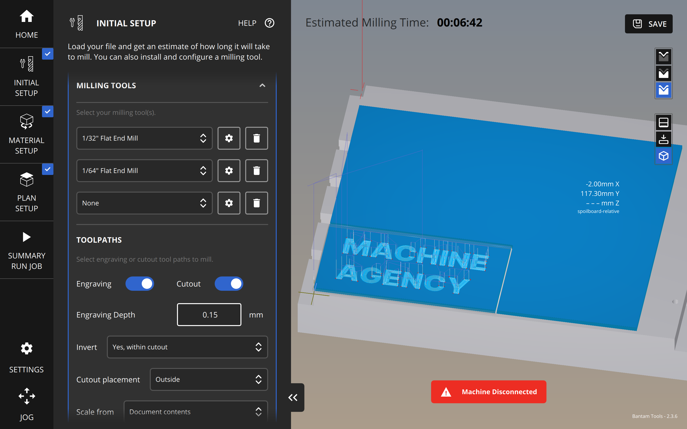

# Othermill Standard Operating Procedure

Last updated on 24 March 2023

This is the Standard Operating Procedure for the Machine Agency Othermill.
For questions about this machine, contact the machine
manager.

- Author: Blair Subbaraman
- PI: Nadya Peek
- Shop Safety Coordinator: Nadya Peek

|                                               |                                                                                                               |
| --------------------------------------------- | ------------------------------------------------------------------------------------------------------------- |
| #1 Process (if applicable)                    | Removes material from the surface of a workpiece                                                              |
| #2 Equipment                                  | Desktop Mill                                                                                                  |
| #3 Personal Protective Equipment (PPE)        | None                                                                                                          |
| #4 Environmental/Ventilation controls         |                                                                                                               |
| #5 Required training or approval              | Contact machine manager for training                                                                          |
| #6 Inspection requirements before use         | N/A                                                                                                           |
| #7 Safe operating procedures or precautions   | See instructions detailed below                                                                               |
| #8 Chemicals/ spill procedures/waste disposal | N/A                                                                                                           |

---

## General Information

**Machine Manager:** Blair Subbaraman, b1air@uw.edu

**Description:** The Othermill is a desktop computer-numerically controlled (CNC) milling machine, 
used primarily for milling printed circuit boards (PCB). Machine Agency has one laser cutter in Sieg 112A.

**Who can use the machine:** Any machine agency member of affliliate.

**How to get access:** If you haven't used the machine before, contact Blair via email or discord and we can
set up a time for training. If you're at all unsure about safe operation, contact Blair. 
Otherwise, access is open to all machine agents and affiliates.

**How to get your access revoked:** Repeatedly breaking the rules.

---

## Rules

1. Do no leave the Othermill running unattended. Stay around the Othermill for the duration of the milling job.
2. Always clean the machine when finished with a vaccum.
3. Turn off the machine when finished.

## Important Information and Safety

1. Spindles are good at spinning! Never put your hand near a moving spindle.
2. There is a red emergency stop button on the side of the machine.

## Materials

If you have questions about acceptable materials, contact the machine manager.
They can add additional materials to this list if needed.

### Acceptable Materials

The following materials are good to use with the machine: 
- FR-1 PCB blanks
- Machining wax
- ABS
- Acrylic
- Wood

### Unacceptable Materials

- Steel
- Iron
- Fiberglass (including FR-4 circuit boards) 
- Glass
- Food (e.g. cheese)

For a more thorough overview of materials, please see the [Bantal Tools website](https://support.bantamtools.com/hc/en-us/articles/115001671654#unsupported-materials). 

## Step-by-step Instructions

The Othermill accepts gerber (`.grb`) and `.svg` files. These instructions cover
how to prepare and use the machine by milling an example `.svg` file. It does not 
cover the use of KiCad/Eagle to create a PCB, though the use of the machine is the 
same.

The example below will use the following materials:
- An FR-1 PCB blank
- Permanant double-side tape (*not* removable tape)
- Calipers

## Before Using the Machine

Before starting, make sure the work envelope is clean. If it is not,
use the shopvac to clean the inside of the machine. 

There should be a PCB blank fixed within the machine-- this is the 
'sacrificial material'. If there is no material in the machine, install
a PCB blank using double-sided tape. Be sure to measure it before doing so.

### While Using the Machine

1. Install the [Bantom Machine Control software](https://www.bantamtools.com/software-download)
if you don't already have it, and download this [example `svg` file](./images/ma.svg).

2. Under 'Initial Setup', select 'Open File' and choose the `svg` file. You should see 
the preview appear.

3. Scroll down the initial setup page. Under 'Milling Tools', choose the end mills
you will be using. For this example, we'll use a 1/32" flat end mill cutting the board 
and 1/64" flat end mill for engraving the interior. 

4. Under toolpaths, change 'Invert' to 'Yes, within cutout'. This will change the
toolpaths so our 'Machine Agency' text is milled out, not everything around it. Whether
you should use this option will change depending on your file.

4. Cover the bottom of your material in *permanent* double sided tape. Removable 
tape won't work.  Don't overlap tape anywhere; we want the work piece to lay
flat in the machine.

5. Select 'Material Setup', and you will see text inputs for the x, y, and z
dimensions of your material. Measure your PCB blank with calipers (with the tape on it!). For the z-dimension,
be sure to measure at a few different points; take the maximum. Input your results.

6. Place your material, tape side down, into the bottom corner of the sacrificial material.
Push down on the material to ensure it's well adhered. Try moving the work piece-- if it does,
go back to step 4. Any wobble will cause problems with the material becoming
detached. 

7. Back in the Bantam software, add the material offset z size based on the sacrificial 
material's height. You can measure this if you didn't install the sacrificial
material yourself; otherwise, 1.7mm is a good default if the sacrificial layer
is an FR-1 blank.

8. Under 'Plan Setup', you can offset the plan in x/y/z, or rotate/scale the plan.
As seen in the image above, the sacrificial layer on the machine isn't aligned to the
front left corner. To compensate, I'll add a plan offset in x & y. There is no need to do
this if the material is aligned properly on your machine. You may get an error for your
`svg` that marked areas need a smaller tool. This is fine for our example.

9. Connect to the machine over USB. You may need a USB-C dongle.

10. A pop-up to home the machine will appear. Select 'Start Homing' to home in X and Y.
Note this will *not* home Z.

11.  Time to install our first tool! Always cut interior elements before exterior ones,
as the piece might otherwise come loose. Under the 'Jog' menu, select 'Install Tool'.
The machine will jog to the center for easy access.

12.  Remove the front safety panel. To uninstall an existing too, use the wrenches on top of the machine.
Use one to keep the spindle in place, and untighten the collet with the other. Be sure to keep a finger
on the end mill to ensure it doesn't drop-- but also be careful, because end mills are sharp! 

(This image shows the setup with one hand so I could take a picture with the other. Please don't
actually do this one handed :).

13. Insert your end mill and re-righten. Make sure the collet is securely fastened back on.

14. In the Bantam software, select the tool you just installed (the 1/64" endmill, in this
case). Select next. Ensure the endmill is over an open area on the bed, and select 'Start'
to home Z. You can jog around the bed to find an empty spot if necessary.

15.  Select start and the tool will touch the bed to home in Z.

16.  We're ready to mill! Make sure the front panel is back on the machine. Under the 
'Summary' tab, you can select 'Mill Single Job'. The machine will start! The software
will guide you through any tool changes which are necessary.

17. When the job is done, use the vacuum to clean up material before uninstalling the 
work piece. You might need to use an e.g. 3D print removal tool.

18. Uninstall your tool and turn off the machine when finished.

## When you have finished using the machine

- Clean up all of your materials from the work area.
- Turn off the machine.
