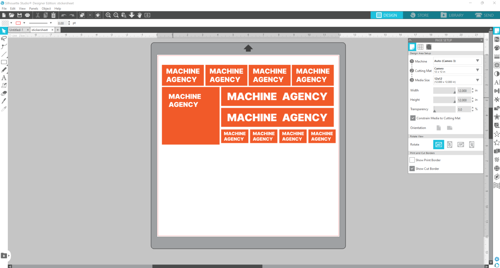
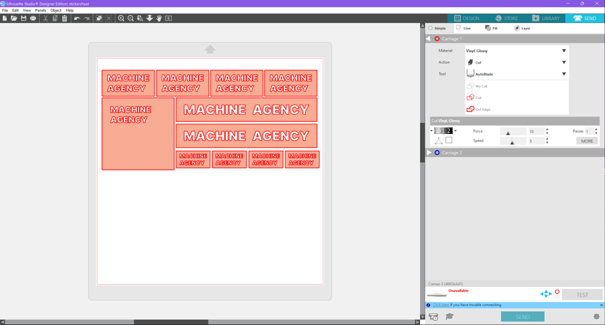
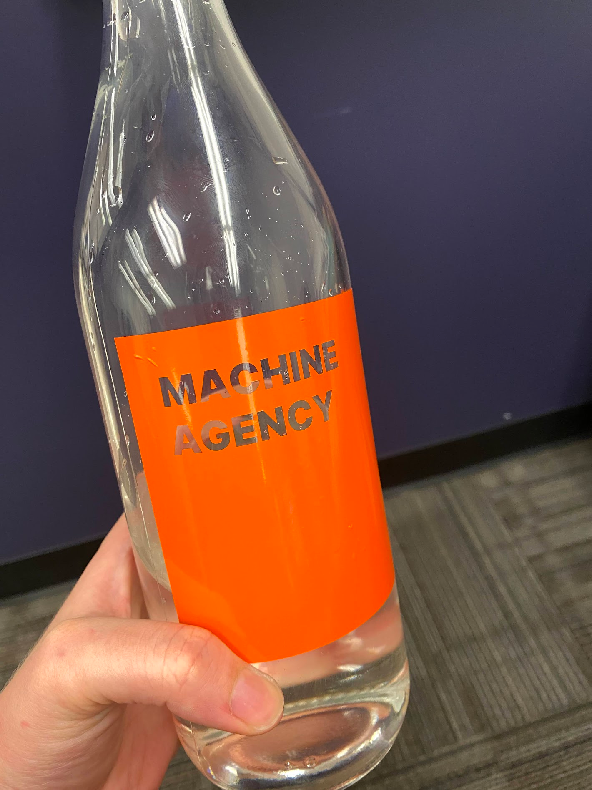
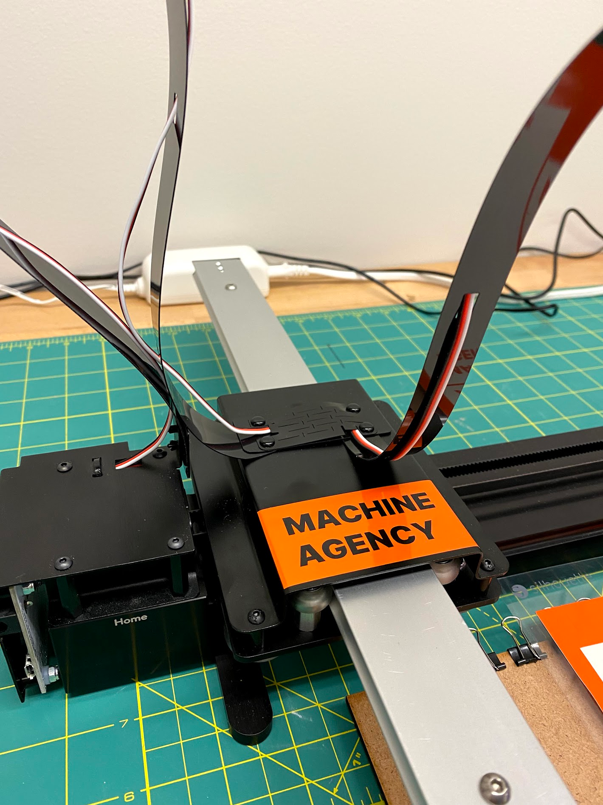

# Silhouette Cameo 3 Standard Operating Procedure

_Last updated on 13 February 2023_

This is the Standard Operating Procedure for the Machine Agency Silhouette Cameo
V3. For questions about this machine, contact the machine manager.

- Author: Hannah Twigg-Smith
- PI: Nadya Peek
- Shop Safety Coordinator: Nadya Peek

|                                               |                                                                              |
| --------------------------------------------- | ---------------------------------------------------------------------------- |
| #1 Process (if applicable)                    | This machine cuts or draws with an end effector, usually a pen or drag knife |
| #2 Equipment                                  | Vinyl Cutter                                                                 |
| #3 Personal Protective Equipment (PPE)        | Tie back long hair                                                           |
| #4 Environmental/Ventilation controls         | N/A                                                                          |
| #5 Required training or approval              | Contact machine manager for training                                         |
| #6 Inspection requirements before use         | N/A                                                                          |
| #7 Safe operating procedures or precautions   | See instructions detailed below                                              |
| #8 Chemicals/ spill procedures/waste disposal | N/A                                                                          |

## General Information

**Machine Manager:** Hannah Twigg-Smith, htwigg (at) uw (dot) edu

**Machine Location:** Machine Agency Shop, Sieg Building 118

**Equipment covered by SOP:** Silhouette Cameo V3, a desktop plotter and vinyl
cutter

**Who can use the machine:** People who have been trained by the machine manager
and are documented in the machine training spreadsheet.

**How to get access:** Email Hannah or message her on Discord

**How to get your access revoked:** Break it? Steal it? Set it on fire?

## Important Information and Safety

Unlike some of the other machines at The Agency, the Silhouette Cameo is very
safe and doesn’t require constant supervision. The downside to this is
Silhouette’s proprietary control interface, which does a very good job of
preventing the machine from hurting itself but does not give you the level of
control of other machines such as the Axidraw. Reverse engineering the Cameo
control protocol would be a cool Machine Agency project!

## Silhouette Studio

Silhouette Studio can be downloaded from
[the Silhouette website](https://www.silhouetteamerica.com/software). The
license key can be found in the Machine Agency drive logistics folder in the
"Machine Agency Software" sheet. The Silhouette Go mobile app can also be used
to send jobs to the machine, which doesn't require a license key.

## Materials

- Vinyl
- Paper/cardstock

We maintain a stock of cardstock and vinyl in the shop on the shelf that has the
machine. If you wish to cut other materials such as fabric or magnet sheets,
talk to the machine manager so they can investigate the impacts of those
materials on the machine.

## Step-by-step Instructions

### Obtaining Design Files

Silhouette Studio can import a number of file formats. SVG is generally the best
format for vinyl cutters and plotters. I recommend creating the files yourself
in vector graphics programs such as Adobe Illustrator or Inkscape. Because the
paths in the file determine the path of the machine, it is useful to understand
how they were made. Double check that you don’t have multiple stacked paths and
that your paths are closed. The direction that you draw your path in can also
affect the order that the machine will draw or cut the paths.

### Setting up a Job

Import your desired files into the Silhouette Studio workspace. This folder also
includes the example files that are used in these screenshots, if you would like
to follow along. You will notice that the workspace includes a skeuomorph of the
cutting mat, which helps you determine where your design will be cut. You can
drag around your designs on the mat to determine where they will be cut. Here,
I’ve laid out some Machine Agency stickers on the cutting mat:

You’ll notice that I’ve tried to conserve material and left little space in
between the stickers. This will also allow me to reuse this sheet of vinyl in
the future, as only half of it has been cut.

Once your designs are laid out in the workspace, you need to tell the Cameo what
to do with them! Navigate to the “Send” tab in the top right of the window. The
Cameo 3 has two tool slots on its carriage, which can be equipped with the
Silhouette cutting blade (the “autoblade”) or a drawing implement such as a pen.
Here, I’ve selected the appropriate options for Carriage 1. The software will
guess the correct presets for the blade speed and force based on the material
and action. If you would like to cut with more force (or you try these settings
and find that they do not work well for your purposes) you can tweak the force
and speed manually. I don’t need a second carriage for this project, so I’ve
left it empty.

The software has highlighted the edges of the designs in red to represent where
the cuts will be made. This looks appropriate for what I am trying to do, so I
am going to continue on to setting up the machine and executing the job.

### Preparing the Cutting Mat

In this case, we are using 12x12” vinyl sheets which fit nicely on the cameo
cutting mat. Remove the protective paper from the sticky side of the mat, and
carefully stick down one sheet of vinyl. There are guides to help you position
it correctly. Line up the vinyl/cutting mat with the machine rollers, turn on
the machine, and press the “load” button that appears. The Cameo will spin the
rollers to move the mat into the machine.

### Connecting to the Machine

The Cameo 3 can connect over bluetooth or USB. As of August 2021, bluetooth
connected automatically to my computer when navigating to the Silhouette Studio
“send” pane. I have tested this on both MacOS and Windows 10/11 with no
problems. To send your file to the Cameo, simply press the “Send” button at the
bottom of the “Send” tab. The Cameo will automatically start cutting. If you are
using the autoblade, it will automatically adjust the blade to the correct
length by moving it up and down a few times. Previous versions of the Cameo
blade were not automatic and required you to set the correct blade length by
twisting the blade.

### After Cutting or Drawing

Press the “Unload” button to remove the cutting mat and material. If the cutting
mat is too sticky, peeling the vinyl or paper from the mat can warp the
material. To avoid this, flip the mat over and peel the mat away from the
material while holding the material flat. When you’ve finished with the machine,
remove pens from the carriage, cap them, and put them away. Turn off the Cameo
by pressing the power button.

### Tips and Tricks

Do all of your design work in vector graphics programs outside of Silhouette
Studio. It is much easier to manipulate individual paths in dedicated programs
such as Inkscape. Silhouette Studio has some basic functionality but you’ll
quickly run into limitations.

## Starter Projects

**Machine Agency stickers!** Have you ever wanted some swanky MA branding for
your laptop, water bottle, or other object? Make some stickers to stick on them!
Some SVGs can be found in the branding folder. All you’ll need to do is import
them and set up a vinyl cutting job.

**Machine name stickers!** If you’re in charge of a machine, why don’t you make
a nice name tag for it? Same as above, but you’ll have to create the design
files/SVGs yourself. This is a good time to practice using transfer tape to
neatly move a bunch of discrete stickers to another surface.

