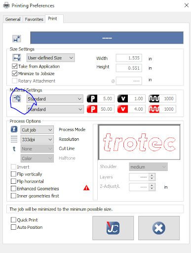

# Trotec Speedy 400 Standard Operating Procedure

Last updated on 24 March 2023

This is the Standard Operating Procedure for the Machine Agency Laser Cutter
(Trotec Speedy 400). For questions about this machine, contact the machine
manager.

- Author: Blair Subbaraman
- PI: Nadya Peek
- Shop Safety Coordinator: Nadya Peek

|                                               |                                                                                                               |
| --------------------------------------------- | ------------------------------------------------------------------------------------------------------------- |
| #1 Process (if applicable)                    | This machine uses a laser to cut/mark/engrave acceptable materials                                            |
| #2 Equipment                                  | Laser cutter                                                                                                  |
| #3 Personal Protective Equipment (PPE)        | None                                                                                                          |
| #4 Environmental/Ventilation controls         | Purex Extraction must be ON for duration of use                                                               |
| #5 Required training or approval              | Contact machine manager for training. Relevant software is not available for use until training is completed. |
| #6 Inspection requirements before use         | N/A                                                                                                           |
| #7 Safe operating procedures or precautions   | See instructions detailed below                                                                               |
| #8 Chemicals/ spill procedures/waste disposal | N/A                                                                                                           |

---

## General Information

**Machine Manager:** Blair Subbaraman, b1air@uw.edu

**Description:** The Trotec Speedy 400 is a laser cutter for quickly cutting &
marking acceptable materials. Machine Agency has one laser cutter in Sieg 112A.

**Who can use the machine:** People who have been trained by the machine manager
and are documented in the machine training spreadsheet.

**How to get access:** Contact Blair via email or discord

**How to get your access revoked:** Repeatedly breaking the rules.

---

## Rules

1. Only operate the laser cutter when someone else is also in the lab! Alert
   them that you will be operating the machine so they can help in the case of
   an emergency. **Do not operate the laser cutter alone; doing so will get your
   access revoked.**
2. Do not leave the laser box (marked by orange tape on floor) while operating.
3. Do not lean on the laser, put things on top of it, or use it as a countertop.
4. Keep Purex Extractor on max while operating the machine. Do not turn the
   Purex extractor on & off repeatedly.

## Important Information and Safety

1. Lasers can start fires! Only operate the machine with someone else present
   and make sure they know you are operating the machine.
2. There is a red emergency stop button next to the on/off key.
3. Opening the lid of the machine also servers as an emergency stop.

## Materials

If you have questions about acceptable materials, contact the machine manager.
They can add additional materials to this list if needed.

### Acceptable Materials

- Paper
- Plywood (< 3/8")
- Delrin
- Cardboard
- Acrylic

Maximimum material thickness is ~0.5".

### Unacceptable Materials

- Plywood > 3/8"
- Anything that releases hazardous chemicals when burned (e.g. PVC,
  polycarbonate, vinyl)

## Step-by-step Instructions

There are multiple ways to generate cut files for the laser (e.g. a vector
graphics editor like Illustrator or Inkscape, a CAD software like Rhino...). The
following instructions us Illustrator as an example.

Note: When the laser is turned on before entering JobControl, the machine
is often not found. To avoid this problem, prepare your cut and enter JobControl 
before turning on & preparing the machine.

## Before Using the Machine

Before starting, alert another person in the lab that you will be operating the
laser cutter. If no one else is in the lab, coordinate another day/time to
operate the machine.

### While Using the Machine

1. Turn the extraction system on using the center button shown below. Keep on
   max, and do not repeatedly turn on & off.

1. Switch the laser on using the key on the front panel. It will automatically
   go through a homing sequence - the bed will end up at the bottom of the
   laser.

1. Place your material on the bed, and if necessary move the laser head using
   the X-Y arrows so that the laser shines on the material. Press the up & down
   Z arrows at the same time to autofocus. The bed should start moving after
   doing this.

1. Turn the fan on using the fan button on the control panel.

1. To demonstrate file preparation we’ll step through an example in Adobe
   Illustrator. Open Illustrator; you’ll have to login with your personal
   information because it wants your data.

2. Open a new file. It is convenient to change the units to e.g. mm instead of
   points.

3. Use the rectangle tool to draw a 50mm x 50mm square.

4. Change the rectangle’s stroke color to be pure black.

5. For the stroke width, enter ‘0.001mm’. Illustrator will convert this to a pt
   value.

6. Print the file. In the ensuing dialog, choose `Trotec Engraver v11.4.0` as
   the printer, then select `Setup…` in the bottom left corner.

1.  In the setup pop-up, select preferences.

1.  You’ll see the following pop-up. Select the circled button if you’d like to
    change material settings, or select an existing profile.

1.  'X’ out of this screen and select ‘print’ on all open dialog boxes. You’ll
    be asked to give your job a name. (Note: you need not go through this
    preferences process next time if your settings are set, you can immediately
    select ‘print’ from the screen in step 10).

2.  JobControl will automatically open after pressing print. If this is your
    first time using JobControl from your account, you’ll need to enter a
    product key. The machine manager will give this to you during training.

3.  Once JobControl is open, drag and drop your named job from the right
    hand-side. It will appear as a box on the screen.

1.  You can now ‘connect’ to the laser using the USB button in the bottom right,
    and then begin the cut!

1.  Don’t leave the lasering area, marked by the tape on the ground! In case of
    an emergency or if you wish to stop the job, press the big red button on the
    laser control panel. In case of fire, the fire extinguisher lives next to
    the laser cutter.

## When you have finished using the machine

- Clean up all of your materials from the work area.
- Power down the machine:
  - Turn the key to the off position
  - Power down the extraction system using the same button used to power on.
